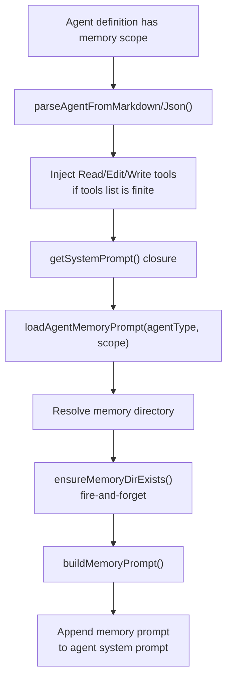
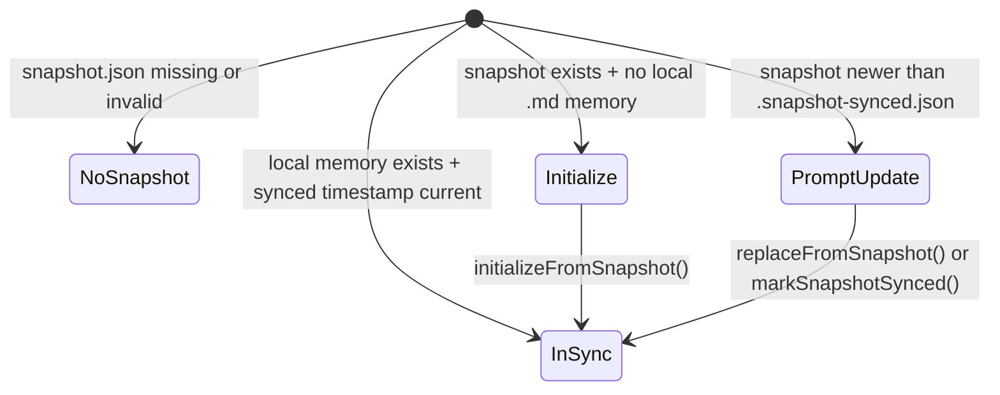
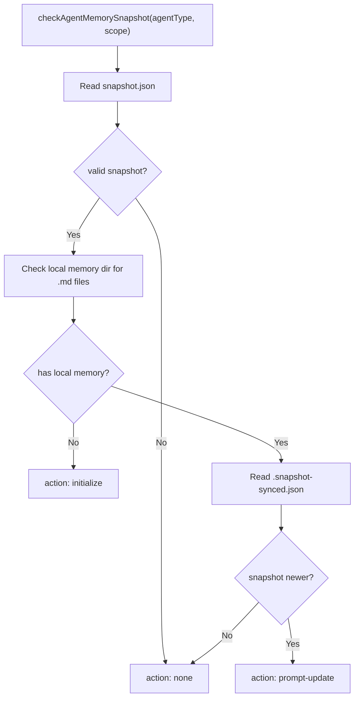

# Agent Memory — Persistent Per-Agent Context

**Sources:** `tools/AgentTool/agentMemory.ts`, `tools/AgentTool/agentMemorySnapshot.ts`

## Purpose

Agent memory gives selected agents their own persistent memory directory and
injects memory-management instructions into the agent's system prompt. Memory is
opt-in via agent definition frontmatter or JSON with `memory: user`, `project`,
or `local`.

## Scopes

| Scope | Directory | Intended Use |
|---|---|---|
| `user` | `<memoryBase>/agent-memory/<agentType>/` | General memories that apply across projects |
| `project` | `<cwd>/.claude/agent-memory/<agentType>/` | Version-controlled project/team memory |
| `local` | `<cwd>/.claude/agent-memory-local/<agentType>/` or remote memory mount | Project-specific local machine memory |

Plugin-style agent types can contain colons, so path names replace `:` with
`-`.

## Memory Prompt Flow



`ensureMemoryDirExists()` is fire-and-forget because `getSystemPrompt()` must be
synchronous in places such as React render. The eventual write path still
creates parent directories if the mkdir has not completed yet.

## Path Detection

`isAgentMemoryPath()` normalizes the candidate absolute path before checking
whether it belongs to any agent-memory scope. This prevents simple `..` path
traversal bypasses. Local memory detection handles both cwd-based storage and
`CLAUDE_CODE_REMOTE_MEMORY_DIR` mount storage.

## Snapshot Layout

Project snapshots live under:

```text
<cwd>/.claude/agent-memory-snapshots/<agentType>/
├── snapshot.json
└── *.md
```

Local agent memory tracks the last synced snapshot in:

```text
<agent-memory-dir>/.snapshot-synced.json
```

`snapshot.json` contains `updatedAt`; `.snapshot-synced.json` contains
`syncedFrom`.

## Snapshot State Machine



## Snapshot Operations



`initializeFromSnapshot()` copies snapshot markdown files into local memory and
writes sync metadata. `replaceFromSnapshot()` first removes existing local
`.md` files to avoid orphans, then copies the snapshot. `markSnapshotSynced()`
only updates metadata.

## Loader Integration

When `AGENT_MEMORY_SNAPSHOT` and automatic memory are enabled,
`getAgentDefinitionsWithOverrides()` initializes memory snapshots for custom
agents whose memory scope is `user`. If a newer snapshot exists after local
memory has already been created, the loader annotates the agent with
`pendingSnapshotUpdate` for later user-facing handling.
