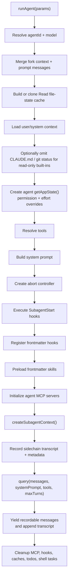
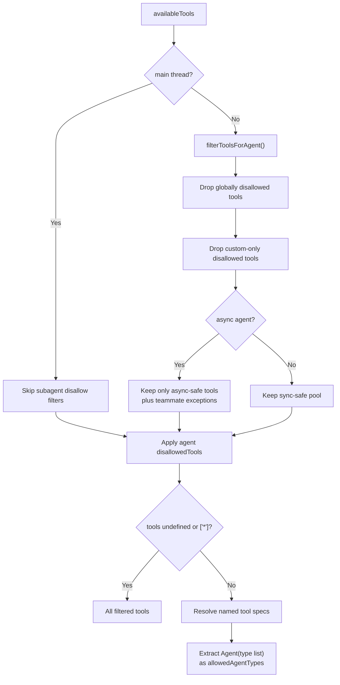
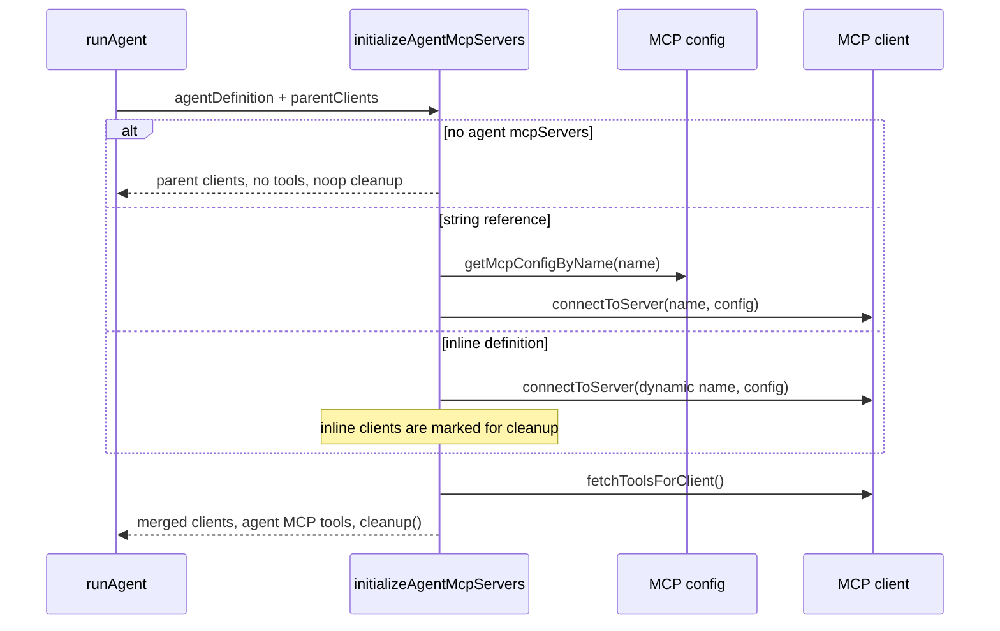
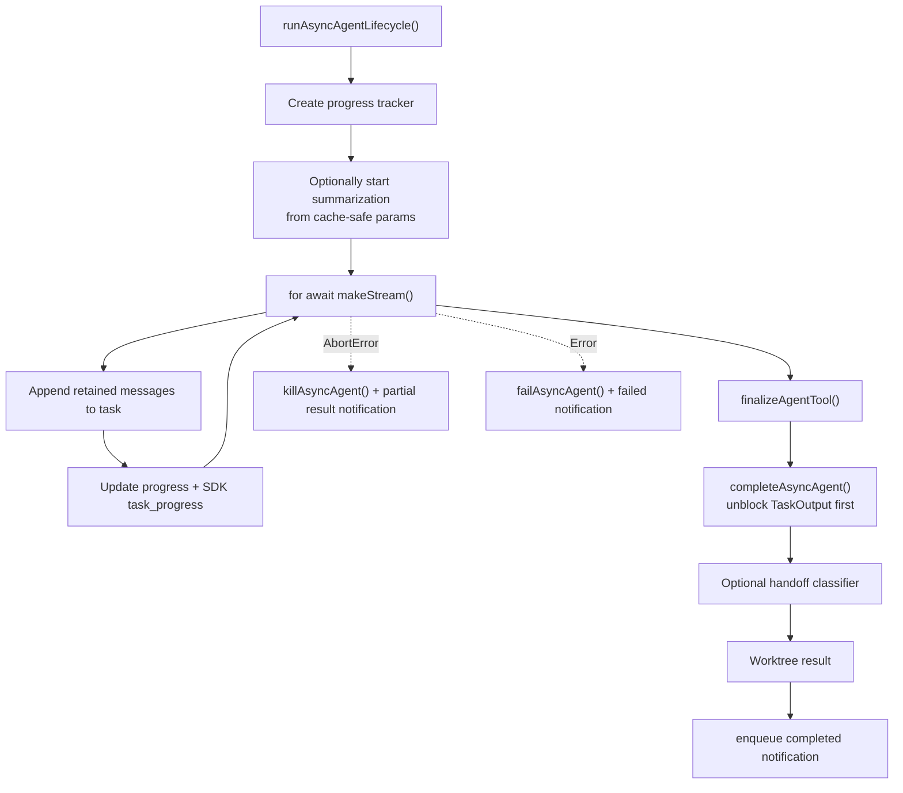

# Agent Runner — Subagent Query Execution

**Sources:** `tools/AgentTool/runAgent.ts`, `tools/AgentTool/agentToolUtils.ts`

## Purpose

`runAgent()` is the execution engine for one subagent invocation. It builds an
agent-specific `ToolUseContext`, resolves the agent's system prompt, tools,
permissions, hooks, skills, MCP clients, and transcript recording, then streams
messages from the shared `query()` loop.

`agentToolUtils.ts` holds shared utilities for tool filtering, result
finalization, handoff classification, progress events, and the background agent
lifecycle used by both fresh launches and resumed agents.

## Runner Flow

## Context Construction

The runner starts from parent context but intentionally mutates several pieces:

- Forked agents receive filtered parent messages plus the fork directive.
- Normal agents start from the task prompt only.
- Async agents get a fresh abort controller; sync agents share the parent's
  controller.
- Async agents normally run as non-interactive sessions; fork agents using
  `useExactTools` inherit the parent's non-interactive and thinking settings.
- `Explore` and `Plan` omit stale `gitStatus`; agents with `omitClaudeMd` can
  omit the `claudeMd` user context under a GrowthBook kill switch.

## Tool Resolution

`resolveAgentTools()` applies the same policy for the runner and other
consumers:

MCP tools are always allowed by the base filter. `ExitPlanMode` is allowed for
agents whose permission mode is `plan`.

## MCP Servers

Agents can specify `mcpServers` in frontmatter or JSON. `runAgent()` calls
`initializeAgentMcpServers()` to add those connections to the inherited parent
MCP clients.

When strict plugin-only MCP customization is active, frontmatter MCP servers are
skipped for user-controlled agents but still allowed for built-in, plugin, and
policy agents.

## Background Lifecycle

`runAsyncAgentLifecycle()` is the shared async driver. It is used for agents
launched in the background from the start, agents backgrounded mid-flight, and
agents resumed from transcript.

The status transition happens before handoff classification and worktree cleanup
because both can hang; the task output should unblock as soon as the subagent
has finished.

## Finalization And Safety Review

`finalizeAgentTool()` takes accumulated messages and returns the last assistant
text content, usage, token count, tool-use count, duration, and agent id. If the
final assistant message contains only a tool call, it falls back to the most
recent assistant text block.

When `TRANSCRIPT_CLASSIFIER` is enabled and permission mode is `auto`,
`classifyHandoffIfNeeded()` builds a transcript and runs the YOLO classifier on
the subagent handoff. A blocking classifier result prepends a security warning
to the returned text; classifier unavailability produces a softer verification
warning.

## Cleanup

The runner cleanup path releases:

- agent-specific MCP clients;
- frontmatter session hooks;
- prompt-cache tracking state;
- cloned read-file state and fork context message arrays;
- Perfetto agent registration;
- transcript subdirectory mapping;
- orphaned todo entries;
- shell and monitor tasks owned by the agent.
