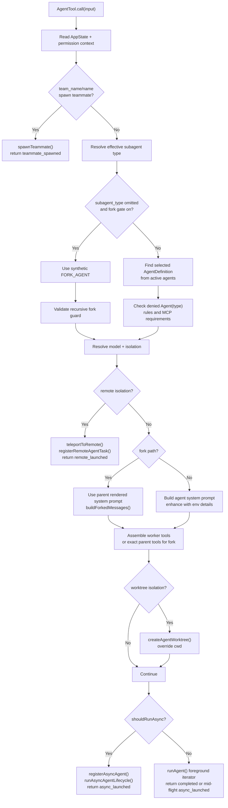
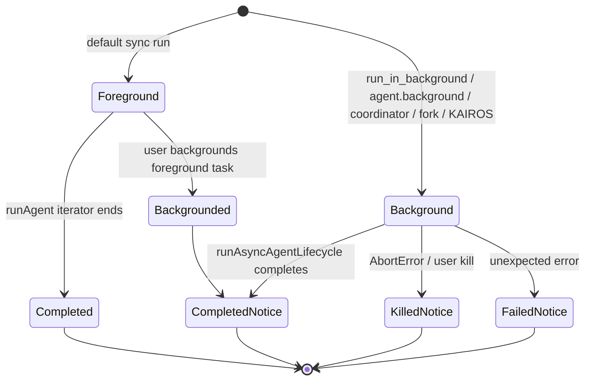

# AgentTool — Delegation Tool Orchestrator

**Source:** `tools/AgentTool/AgentTool.tsx`

## Purpose

`AgentTool` is the public tool that lets the main Claude Code loop delegate work
to another agent. It is intentionally more than a thin wrapper: it validates
agent choice, enforces feature gates and permission rules, handles team and fork
variants, chooses sync vs. background execution, sets up worktree or remote
isolation, and maps internal results back into `tool_result` text for the parent
model.

## Public Shape

The tool is registered with `buildTool()` as `Agent`, with legacy alias `Task`.
Its input schema is built lazily so feature flags can hide unsupported fields.

| Field | Role |
|---|---|
| `description` | Short user-facing task label, used in UI/task lists |
| `prompt` | Full task briefing for the spawned agent |
| `subagent_type` | Optional agent type; defaults to `general-purpose` unless fork mode is active |
| `model` | Optional model override for normal subagents |
| `run_in_background` | Optional async launch, hidden when backgrounding is disabled or fork mode is active |
| `name`, `team_name`, `mode` | Agent-team / teammate parameters |
| `isolation` | Optional `worktree`; `remote` exists only in ant builds |
| `cwd` | KAIROS-only working-directory override, omitted when unavailable |

The output schema exposes two normal statuses: `completed` and
`async_launched`. Internal paths also return `teammate_spawned` and
`remote_launched`, but those are intentionally excluded from the public schema
for dead-code elimination.

## Launch Decision Flow

## Agent Selection

Normal calls resolve `subagent_type` against
`toolUseContext.options.agentDefinitions.activeAgents`. If `allowedAgentTypes`
was produced by an `Agent(foo,bar)` tool rule, the active list is filtered first.
The call path distinguishes "not found" from "exists but denied" so permission
errors can name the denying rule source.

Fork mode is different: omitting `subagent_type` selects a synthetic `FORK_AGENT`
that is not listed in built-ins. The fork path inherits the parent's context and
system prompt, and recursive forks are blocked using both `querySource` and a
message scan for fork boilerplate.

## Permission And Tool Setup

`AgentTool` itself is `isReadOnly() === true`; actual file/shell permissions are
delegated to the spawned agent's tool calls. Before launch it still checks:

- agent-team constraints, such as no nested teammates;
- required MCP servers, waiting up to 30 seconds for pending required servers;
- user permission deny rules for specific `Agent(type)` calls;
- async availability and in-process teammate restrictions.

Worker tools are assembled with a separate permission context using the agent's
`permissionMode` or `acceptEdits`. Fork workers instead receive the parent's
exact tool array so their API request prefix can remain cache-identical.

## Sync, Background, And Mid-Flight Backgrounding

Foreground agents are registered as foreground tasks so they can be backgrounded
after launch. Once backgrounded, the original iterator is returned, and a new
async lifecycle continues the same agent with retained messages and progress
tracking.

## Isolation

Worktree isolation creates a temporary worktree before launch and runs the agent
with a cwd override. Cleanup is conservative:

- if there is no VCS change relative to the captured head commit, the worktree
  is removed;
- if changes exist, the worktree path and branch are returned in the result;
- hook-based worktrees are kept because changes cannot be reliably detected.

Remote isolation is ant-only. It checks remote eligibility, calls
`teleportToRemote()`, registers a remote task, and returns a CCR session URL.

## Result Mapping

`mapToolResultToToolResultBlockParam()` turns internal output into parent-visible
tool results:

- `teammate_spawned`: returns teammate id/name/team routing details.
- `remote_launched`: tells the parent a CCR session is running.
- `async_launched`: tells the parent not to duplicate the background agent's
  work and optionally provides an output file path.
- `completed`: returns final text blocks plus an `agentId` continuation hint and
  usage trailer, except one-shot built-ins such as `Explore` and `Plan` skip the
  trailer to save tokens.
