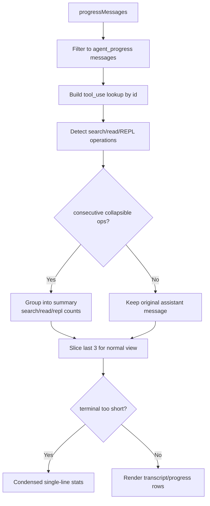
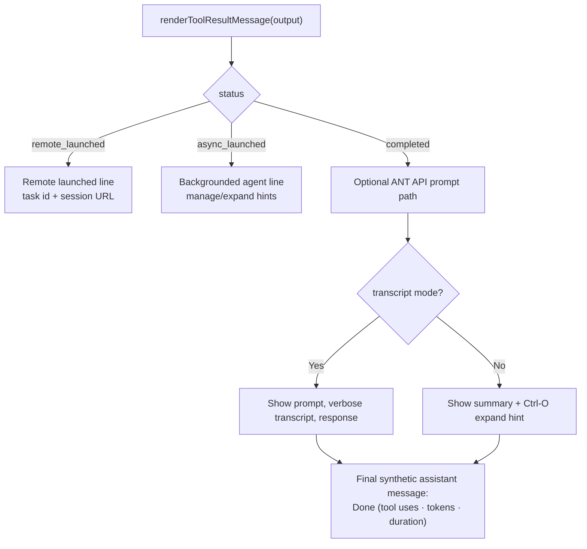

# Agent UI — Progress And Result Rendering

**Sources:** `tools/AgentTool/UI.tsx`, `tools/AgentTool/agentDisplay.ts`, `tools/AgentTool/agentColorManager.ts`, `tools/AgentTool/constants.ts`

## Purpose

The Agent UI code renders `Agent` tool calls in the terminal. It has to support
several shapes: foreground agents, background agents, completed agents with
expandable transcripts, rejected/error tool calls, remote launches, and grouped
parallel agent calls.

## Rendering Surfaces

| Function | Role |
|---|---|
| `renderToolUseMessage()` | Shows the task description while an agent is invoked |
| `renderToolUseTag()` | Shows model override tag when different from the main model |
| `renderToolUseProgressMessage()` | Shows live progress, compacting when terminal space is small |
| `renderToolResultMessage()` | Shows completion, background launch, remote launch, and transcript details |
| `renderToolUseRejectedMessage()` | Shows progress collected before a rejection plus fallback rejection UI |
| `renderToolUseErrorMessage()` | Shows progress collected before an error plus fallback error UI |
| `renderGroupedAgentToolUse()` | Collapses multiple parallel Agent tool uses into a grouped progress panel |

## Progress Processing

Progress events can include agent messages or forwarded shell progress. UI
helpers first guard with `hasProgressMessage()` before reading message fields.

Only tool-result messages increment grouped search/read counts, avoiding double
counting each tool-use/tool-result pair.

## Result Rendering

Completed output is rendered as a synthetic assistant message so normal message
formatting can show usage and duration consistently.

## Grouped Parallel Agents

`renderGroupedAgentToolUse()` receives all Agent tool uses in a grouped render
slot. It calculates per-agent stats, detects async/background outputs, extracts
last tool activity, and renders a compact list through `AgentProgressLine`.

The grouped header adapts to state:

- all complete and all async: "`N` background agents launched";
- all complete and foreground: "`N` agents finished";
- otherwise: "Running `N` agents...".

If every row is the same agent type, row labels hide the repeated type.

## Display Helpers

`agentColorManager.ts` stores configured agent colors in the global agent color
map. `general-purpose` deliberately has no color. Valid color names map to
subagent-only theme keys.

`agentDisplay.ts` is shared by `claude agents` and `/agents`. It defines source
group ordering, resolves overridden agents against the active list, deduplicates
worktree duplicates, and provides model/source display helpers.

`constants.ts` centralizes wire names:

- `AGENT_TOOL_NAME = 'Agent'`
- `LEGACY_AGENT_TOOL_NAME = 'Task'`
- `VERIFICATION_AGENT_TYPE = 'verification'`
- `ONE_SHOT_BUILTIN_AGENT_TYPES`, currently including `Explore` and `Plan`, for
  suppressing continuation trailers in tool results.
