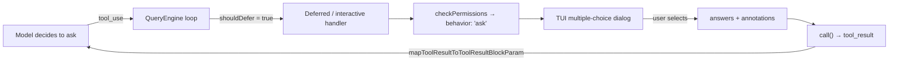
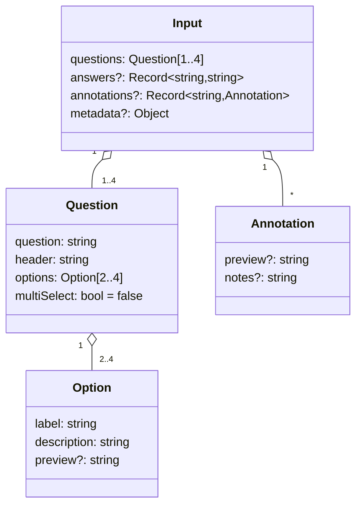
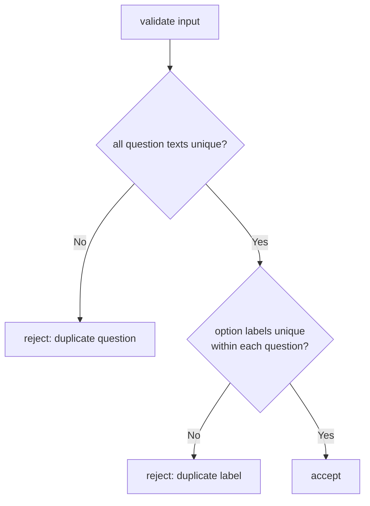
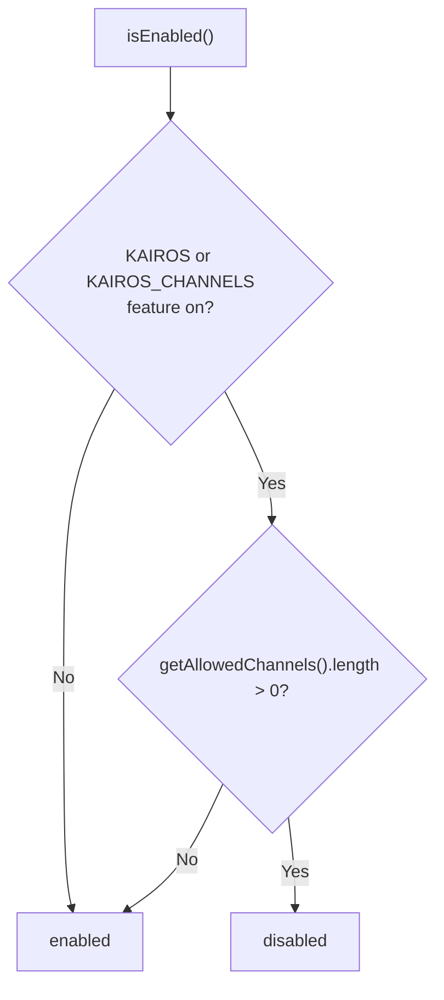
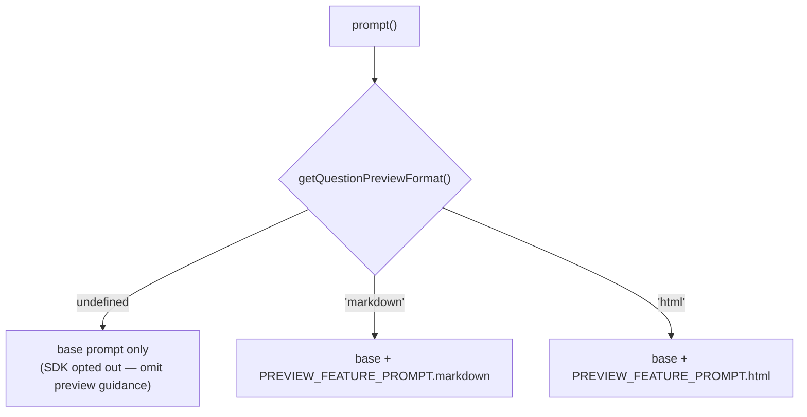
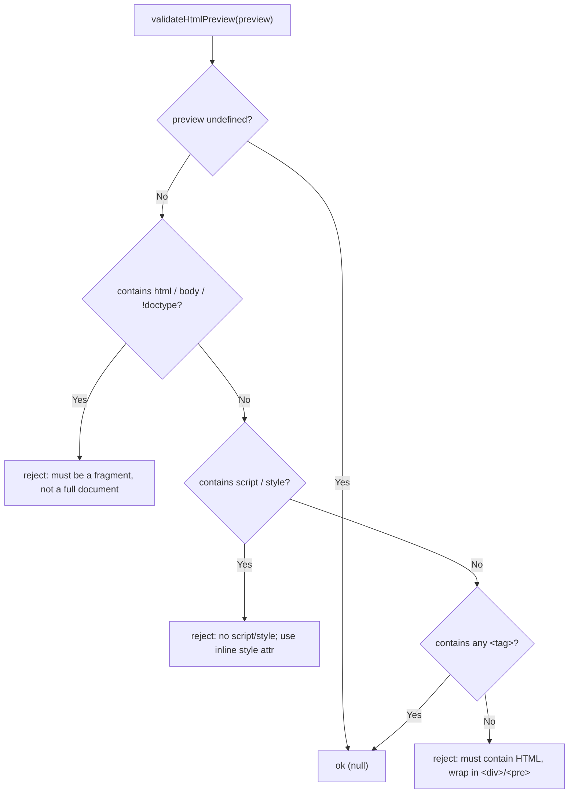
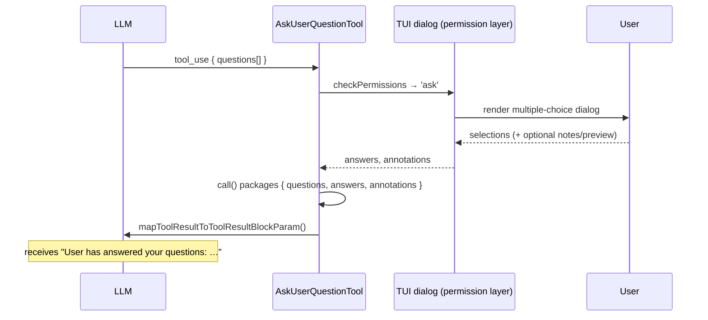

# AskUserQuestionTool — Interactive Multiple-Choice Prompting

This directory documents the `AskUserQuestion` tool — the mechanism by which the
agent pauses execution to ask the user one or more structured multiple-choice
questions and resumes with the selected answers.

## Module Map

```
tools/AskUserQuestionTool/
├── AskUserQuestionTool.tsx   # Tool definition: schemas, lifecycle, UI, validation
└── prompt.ts                 # Tool name, description, model-facing prompt, preview prompts
```

The subsystem is intentionally small. `prompt.ts` holds only constants and the
model-facing prompt text; `AskUserQuestionTool.tsx` holds the Zod schemas, the
`ToolDef` lifecycle implementation, the HTML-preview validator, and the small
Ink components used to render results in the TUI.

## Purpose

`AskUserQuestion` lets the model gather information mid-run instead of guessing.
It is used to:

1. Gather user preferences or requirements.
2. Clarify ambiguous instructions.
3. Get decisions on implementation choices.
4. Offer the user a choice of direction.

It presents **1–4 questions**, each with **2–4 options**. An implicit "Other"
(free-text) choice is always added by the UI, so the model must never author one.
The tool is read-only and does not mutate any state — its only effect is to block
until the user answers.

## Where It Sits in the Tool System



Because the tool requires a human at the keyboard, several lifecycle flags steer
the harness toward an interactive flow rather than an automatic one (see
[Lifecycle & Flags](#lifecycle--flags)).

## Schema Design

All schemas are wrapped in `lazySchema(() => …)` so the Zod object is built only
on first access — keeping module import cheap and avoiding eager validation graph
construction.

### Input



Key field semantics:

| Field | Where | Meaning |
|-------|-------|---------|
| `header` | Question | Short chip/tag label, capped at `ASK_USER_QUESTION_TOOL_CHIP_WIDTH` (12) chars. |
| `multiSelect` | Question | When `true`, the user may pick several options; answers are joined comma-separated. |
| `preview` | Option | Optional rich content (markdown or HTML fragment) shown when the option is focused. |
| `answers` | Input | Pre-filled answers collected by the permission component; defaults to `{}`. |
| `annotations` | Input | Per-question extras the user attached: the chosen `preview` and free-text `notes`. Keyed by question text. |
| `metadata.source` | Input | Analytics tag (e.g. `"remember"` for the `/remember` command). Never shown to the user. |

The input schema is a `z.strictObject` (rejects unknown keys) and carries a
`.refine()` uniqueness check.

### Uniqueness Refinement (`UNIQUENESS_REFINE`)



This guarantees answers can be keyed unambiguously by question text, and that the
UI never shows two identical option labels in one question.

### Output

The output schema echoes the `questions`, plus:

- `answers` — map of *question text → answer string* (multi-select answers are
  comma-separated).
- `annotations` — the same optional per-question previews/notes structure.

### SDK Exposure

```ts
export const _sdkInputSchema = inputSchema
export const _sdkOutputSchema = outputSchema
```

The internal and SDK-facing schemas are now identical. The `preview` and
`annotations` fields were promoted to public surface and are configurable by SDK
consumers via `toolConfig.askUserQuestion`.

## Lifecycle & Flags

The tool is assembled with `buildTool({...} satisfies ToolDef)`. The notable
properties:

| Member | Value / Behavior | Why |
|--------|------------------|-----|
| `name` | `AskUserQuestion` | Stable identifier. |
| `shouldDefer` | `true` | Routes the call through the deferred/interactive path rather than inline auto-execution. |
| `isReadOnly()` | `true` | No side effects; safe under read-only constraints. |
| `isConcurrencySafe()` | `true` | Multiple may be scheduled without conflict. |
| `requiresUserInteraction()` | `true` | Marks that a human must respond — used to skip the tool on non-interactive relays. |
| `maxResultSizeChars` | `100_000` | Large cap to allow rich preview content in results. |
| `userFacingName()` | `''` | Suppresses a tool name label in the UI (the dialog speaks for itself). |
| `checkPermissions()` | always `behavior: 'ask'` | Every invocation prompts; there is no auto-approve path. |
| `toAutoClassifierInput()` | joins question texts with ` \| ` | Feeds the permission/auto classifier a compact summary. |

### `isEnabled()` — Channel Gating



When `--channels` is active the user is likely on Telegram/Discord, not watching
the TUI. A multiple-choice dialog would hang with nobody at the keyboard, and the
channel permission relay already skips `requiresUserInteraction()` tools, so there
is no alternate approval path. The tool therefore disables itself.

## Preview Feature

Options may carry a `preview` for side-by-side visual comparison (UI mockups,
code snippets, diagrams, config examples). The active **preview format** is
resolved at runtime via `getQuestionPreviewFormat()` and drives both the prompt
text and validation.



- **markdown** — preview is rendered as markdown in a monospace box; the UI
  switches to a side-by-side layout (option list left, preview right).
- **html** — preview must be a self-contained HTML *fragment* (no
  `<html>`/`<body>` wrapper, no `<script>`/`<style>`).
- Previews are **single-select only** (not supported with `multiSelect`).

### `validateHtmlPreview()`

When the format is `html`, `validateInput()` runs each option's preview through a
lightweight intent check (deliberately *not* a full HTML5 parser, which would
accept anything):



The `<script>`/`<style>` ban exists because SDK consumers typically inject the
preview via `innerHTML`; blocking these tags prevents a preview from executing
code or restyling the host page. Inline event handlers (`onclick` etc.) are still
possible, so consumers are expected to sanitize. For non-HTML formats,
`validateInput()` short-circuits to `{ result: true }`.

## Execution & Result Mapping

`call()` is trivial — it simply packages whatever the permission/UI component
collected back into the output shape (answers default to `{}`,
`annotations` included only when present). The real work of presenting the dialog
and gathering selections happens in the interactive permission layer upstream;
the tool body just normalizes the result.



### `mapToolResultToToolResultBlockParam()`

Converts the structured answers into a single natural-language `tool_result`
string for the model. For each answered question it emits `"question"="answer"`,
and appends, when present:

- `selected preview:\n<preview>` — the preview content of the chosen option.
- `user notes: <notes>` — any free-text the user added.

The parts are space-joined per question, questions are comma-joined, and the whole
is wrapped as:

> `User has answered your questions: <…>. You can now continue with the user's answers in mind.`

## UI Rendering

The tool defines small Ink components and render hooks:

| Hook | Renders |
|------|---------|
| `renderToolUseMessage()` | `null` — no pre-execution echo (the dialog is the message). |
| `renderToolUseProgressMessage()` | `null` — nothing while waiting. |
| `renderToolResultMessage()` | `AskUserQuestionResultMessage` — a `● User answered Claude's questions:` header followed by `· <question> → <answer>` lines. |
| `renderToolUseRejectedMessage()` | `● User declined to answer questions`. |
| `renderToolUseErrorMessage()` | `null`. |

`AskUserQuestionResultMessage` is memoized via the React compiler runtime
(`_c` cache), keying its rendered body on the `answers` object so it only
re-renders when answers change. The leading bullet uses `getModeColor('default')`
to match the active permission-mode color.

## Plan-Mode Contract

The model-facing prompt (`ASK_USER_QUESTION_TOOL_PROMPT`) carries a specific
rule for plan mode: use `AskUserQuestion` to clarify requirements or choose
between approaches **before** finalizing a plan, but never to ask "Is my plan
ready?" or "Should I proceed?" — those belong to `ExitPlanMode`. The model is
also told not to reference "the plan" in questions, since the user cannot see the
plan in the UI until `ExitPlanMode` is called.

## Authoring Conventions Enforced by the Prompt

- A recommended option must be listed **first** with `(Recommended)` appended to
  its label.
- The model must not author an "Other" option — the UI always provides one.
- Use `multiSelect: true` only when choices are not mutually exclusive.
```

