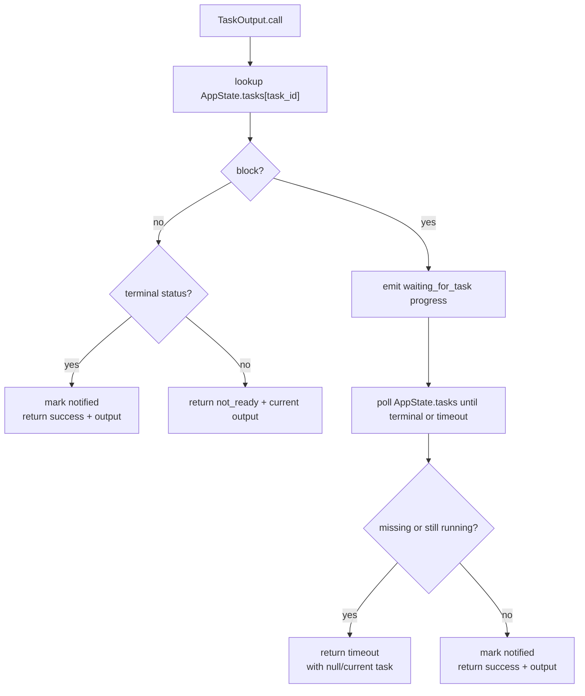
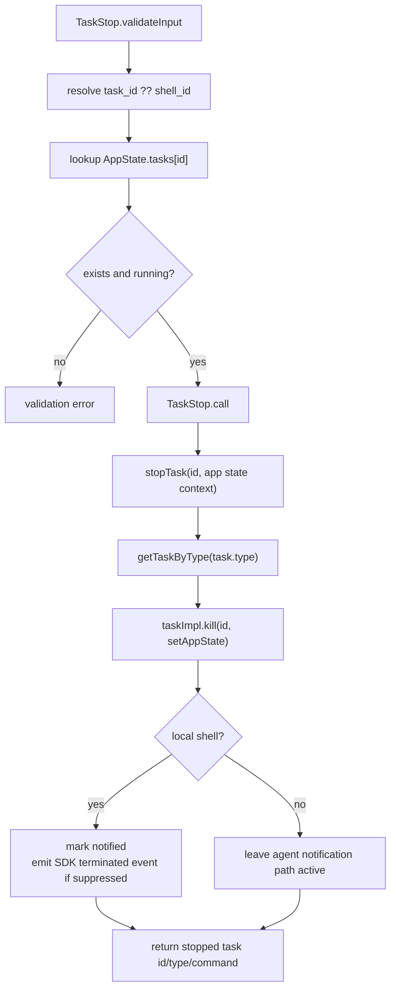

# Runtime Task Tools - Background Output And Stop Controls

**Sources:** `tools/TaskOutputTool/TaskOutputTool.tsx`,
`tools/TaskStopTool/TaskStopTool.ts`, `tasks/stopTask.ts`,
`utils/task/diskOutput.ts`, `utils/task/framework.ts`

## Purpose

Runtime task tools operate on live background tasks in `AppState.tasks`. These
tasks are separate from the TodoV2 JSON task list. They represent running or
finished background shell commands, async local agents, and remote sessions.

`TaskOutput` is deprecated for model guidance in favor of reading the task's
output file path directly, but it remains implemented for compatibility.
`TaskStop` is the LLM-invoked control surface for stopping a running background
task.

## Tool Shape

| Tool | Input | Output | Aliases |
|---|---|---|---|
| `TaskOutput` | `task_id`, `block` default true, `timeout` default 30000 ms | retrieval status plus task status/output | `AgentOutputTool`, `BashOutputTool` |
| `TaskStop` | `task_id`, or deprecated `shell_id` | stopped task id/type/command message | `KillShell` |

`TaskOutput` is read-only. `TaskStop` mutates task state by invoking the task
implementation's `kill()` method.

## TaskOutput Flow

Output retrieval is type-specific:

- `local_bash`: prefer the in-memory `taskOutput` object for stdout/stderr,
  falling back to disk output; include the exit code when available.
- `local_agent`: prefer the clean final assistant response from in-memory
  result content over the raw JSONL transcript symlink; include prompt and
  error if present.
- `remote_agent`: include the remote command as the prompt-like field.
- other task types: return common id/type/status/description/output fields.

The model-facing result is XML-like text with `retrieval_status`, `task_id`,
`task_type`, `status`, optional `exit_code`, formatted `output`, and optional
`error`. UI rendering delegates bash output to `BashToolResultMessage` and
agent output to `AgentPromptDisplay` / `AgentResponseDisplay`.

## TaskStop Flow

`tasks/stopTask.ts` is shared by `TaskStopTool` and the SDK `stop_task` control
request. It throws `StopTaskError` with one of `not_found`, `not_running`, or
`unsupported_type` when the task cannot be stopped.

For local shell tasks, stop suppression marks the task notified to avoid a noisy
exit-code notification, then emits a direct SDK termination event so SDK
consumers still observe task closure. Agent tasks keep their notification path
because their abort handler can include partial agent output.

## Relationship To Notifications

Runtime tasks also feed attachment and notification paths outside these tools.
`TaskOutput` marks terminal tasks as `notified` after reading output. `TaskStop`
marks local shell tasks as notified after killing them. Agent and remote tasks
may produce their own completion, failure, or termination notifications through
their task implementations.

## Boundary With TodoV2

Runtime `task_id` values identify entries in `AppState.tasks`; TodoV2 `taskId`
values identify JSON records under `utils/tasks.ts`. The names are similar, but
the stores, lifecycles, and UI surfaces are different:

- TodoV2 tasks track planned work and progress.
- Runtime background tasks track executing processes or agents.
- `TaskList` does not list runtime background tasks.
- `TaskOutput` and `TaskStop` do not operate on TodoV2 task-list records.
