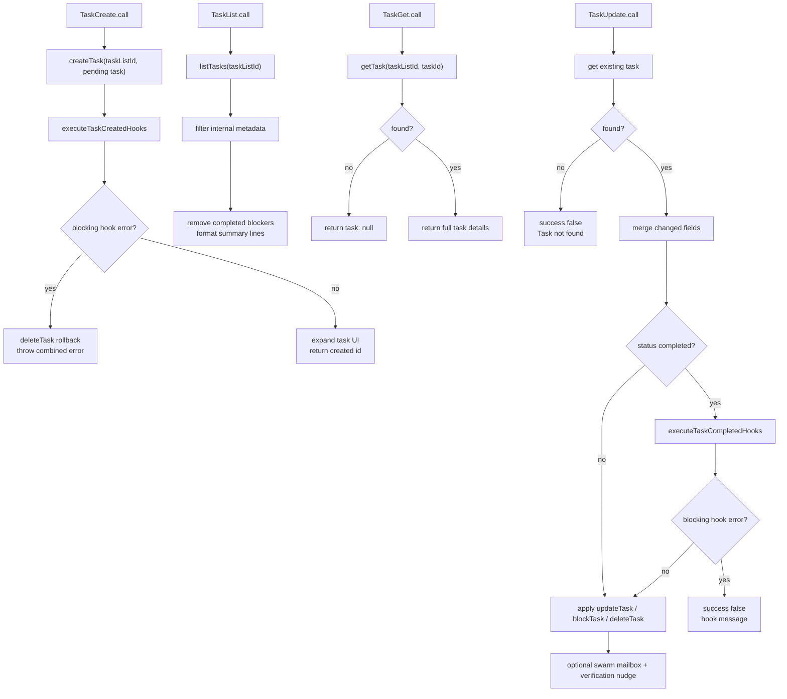

# Task List Tools - TodoV2 CRUD Surface

**Sources:** `tools/TaskCreateTool/TaskCreateTool.ts`,
`tools/TaskGetTool/TaskGetTool.ts`, `tools/TaskUpdateTool/TaskUpdateTool.ts`,
`tools/TaskListTool/TaskListTool.ts`, `tools/*/prompt.ts`

## Purpose

The TodoV2 Task tools expose a persistent task list to the model. They replace
plain todo text with structured records that can be created, listed, fetched,
updated, assigned, blocked by dependencies, completed, or deleted. The tools are
quiet in the transcript UI (`renderToolUseMessage()` returns `null`) and return
compact text summaries to the parent model.

All four tools use `buildTool()`, set `shouldDefer: true`, are concurrency-safe,
and are available only when `isTodoV2Enabled()` is true.

## Public Shape

| Tool | Input | Output | Read-only |
|---|---|---|---|
| `TaskCreate` | `subject`, `description`, optional `activeForm`, optional `metadata` | created `task.id` and `subject` | No |
| `TaskGet` | `taskId` | nullable full task fields: `id`, `subject`, `description`, `status`, `blocks`, `blockedBy` | Yes |
| `TaskUpdate` | `taskId`, optional field updates, optional dependency additions, optional `status`, optional `metadata` | success flag, updated fields, optional status change/error/nudge | No |
| `TaskList` | no fields | visible task summaries: `id`, `subject`, `status`, optional `owner`, unresolved `blockedBy` | Yes |

`TaskUpdate.status` accepts the normal task statuses plus a special `deleted`
action. Deletion removes the JSON file and cascades dependency cleanup through
`utils/tasks.ts`.

## CRUD Flow

## Tool-Specific Behavior

`TaskCreate` always creates tasks as `pending` with no owner, empty `blocks`,
and empty `blockedBy`. After creation it runs `TaskCreated` hooks. Blocking hook
errors roll back by deleting the new task before surfacing the error. Successful
creation auto-expands the task list in app state.

`TaskGet` is a read-only lookup. Missing or invalid tasks return a successful
tool result containing "Task not found" instead of throwing.

`TaskList` filters out tasks with `metadata._internal`, hides blockers that are
already completed, and returns a line-oriented summary. It does not include full
descriptions; callers use `TaskGet` for that.

`TaskUpdate` first checks that the task exists, then only writes fields that
changed. It can update basic fields, merge metadata, set an owner, add
dependency edges, complete the task, or delete it. A `metadata` key set to
`null` is removed from the stored metadata object.

## Hooks, Teams, And Nudges

Task creation runs `executeTaskCreatedHooks()`. Completion runs
`executeTaskCompletedHooks()` before status is changed; blocking errors keep the
task open and return a non-throwing failure result so sibling tool calls are not
cancelled by the streaming executor.

When agent swarms are enabled, `TaskUpdate` auto-sets the owner if a teammate
marks an unowned task `in_progress`. Owner changes write a mailbox assignment
message for the new owner. When a teammate completes a task, the result reminds
it to call `TaskList` for newly available work.

When the verification-agent feature gate is active, a main-thread completion of
the final item in a 3+ task list can append a verification-agent reminder if no
task subject mentions verification.

## Result Mapping

The tools map structured outputs back into short model-facing text:

- `TaskCreate`: `Task #<id> created successfully: <subject>`
- `TaskGet`: full task detail lines, including dependencies when present
- `TaskUpdate`: updated field names, or a benign failure message
- `TaskList`: one line per visible task, including status, owner, and blockers

These result strings are the model contract. The UI separately renders the
persistent task list through `useTasksV2()` rather than through tool-use output.
