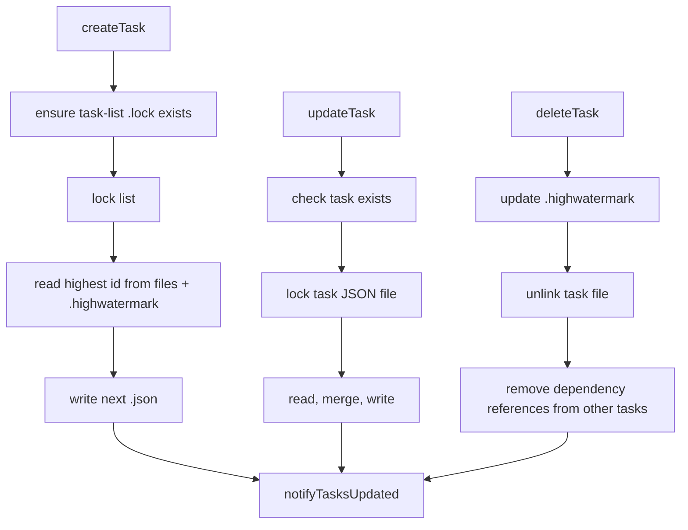

# Task Storage - TodoV2 Persistence And UI Refresh

**Sources:** `utils/tasks.ts`, `hooks/useTasksV2.ts`

## Purpose

TodoV2 tasks are persisted as JSON files under the Claude config directory so
multiple agents or processes can share a task list. The storage layer owns task
identity, path sanitization, status schema validation, file locking, dependency
maintenance, and in-process update notifications.

## Task Model

```ts
type Task = {
  id: string
  subject: string
  description: string
  activeForm?: string
  owner?: string
  status: 'pending' | 'in_progress' | 'completed'
  blocks: string[]
  blockedBy: string[]
  metadata?: Record<string, unknown>
}
```

`TaskSchema` validates records on read. Ant-only migration code maps older
status names such as `open`, `resolved`, `planning`, `implementing`,
`reviewing`, and `verifying` into the current status set.

## Task List Identity

`getTaskListId()` resolves the active list in priority order:

| Priority | Source | Purpose |
|---|---|---|
| 1 | `CLAUDE_CODE_TASK_LIST_ID` | explicit override |
| 2 | in-process teammate context | share the team task list |
| 3 | `CLAUDE_CODE_TEAM_NAME` through `getTeamName()` | process-based teammate list |
| 4 | leader team name set by `TeamCreateTool` | leader and teammates converge on one list |
| 5 | session ID | standalone fallback |

Paths are built as:

```text
<claude-config-home>/tasks/<sanitized-task-list-id>/<sanitized-task-id>.json
```

Path components allow only letters, numbers, hyphens, and underscores. Other
characters are replaced with `-`.

## Storage And Locking



Task creation and reset use a task-list lock. Updates lock the individual task
file after confirming the file exists. `claimTask()` can use either task-level
locking or a list-level lock when it must atomically check whether an agent is
already busy before assigning ownership.

The `.highwatermark` file prevents ID reuse after tasks are deleted or a list is
reset. `resetTaskList()` clears task JSON files but first preserves the highest
ID seen so future task IDs keep increasing.

## Dependencies And Claiming

`blockTask(taskListId, fromTaskId, toTaskId)` writes both sides of the edge:
the source task's `blocks` list and the target task's `blockedBy` list.
Deleting a task removes references to it from every other task.

`claimTask()` refuses claims when the task is missing, already claimed by
another agent, already completed, blocked by unresolved tasks, or when the
optional busy check finds that the agent already owns unresolved work.

## UI Store

`useTasksV2()` exposes a shared singleton `TasksV2Store` through
`useSyncExternalStore`. The store combines:

- `fs.watch()` on the current task directory;
- in-process `onTasksUpdated()` notifications;
- debounced refreshes;
- a fallback poll while incomplete tasks exist.

The store watches the current `getTaskListId()` directory and rewatches when
the list ID changes mid-session, such as after team creation.

When all visible tasks are completed, the store waits five seconds, verifies the
same task list still contains only completed tasks, calls `resetTaskList()`, and
then hides the UI. `useTasksV2WithCollapseEffect()` additionally collapses the
expanded task-list panel when the list becomes hidden.

## Enablement

`isTodoV2Enabled()` returns true for normal interactive sessions. It returns
true in non-interactive sessions only when `CLAUDE_CODE_ENABLE_TASKS` is truthy.
The hook also suppresses task-list display for non-lead team members so the lead
owns the visible shared list.
