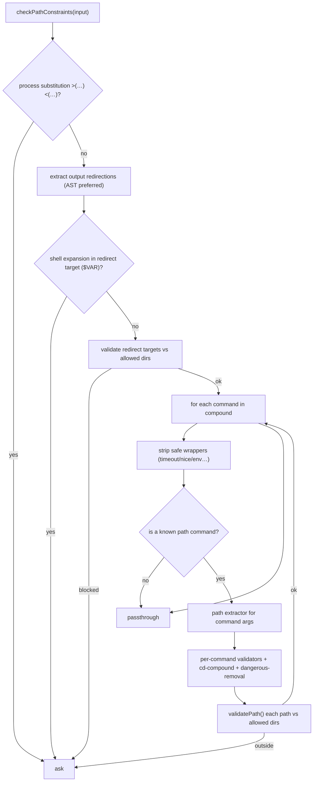
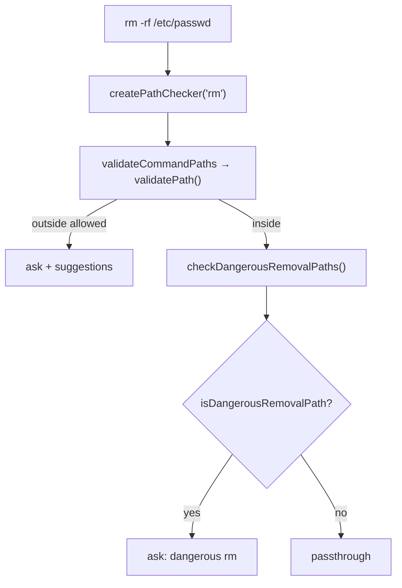

# pathValidation — Filesystem Boundary Enforcement

**Source:** `pathValidation.ts`

This module extracts the filesystem paths a command touches and validates them
against the session's allowed directories and protected files. It is what stops a
command from reading or writing outside the working directory, deleting system
paths, or escaping boundaries via flag tricks.

## Purpose & Threat Model

Without path enforcement a command could:

- escape the working dir (`cd /home && cat /etc/passwd`),
- modify protected config (`mv x .claude/settings.json`),
- exploit flag bypasses (`mv --target-directory=…`, `find -- -path /etc`),
- chain a write across a `cd` boundary (`cd .claude && rm settings.json`),
- or remove a critical system path (`rm -rf /`).

## Entry Point

```ts
function checkPathConstraints(
  input, cwd, toolPermissionContext,
  compoundCommandHasCd?, astRedirects?, astCommands?,
): PermissionResult
```

It returns `passthrough` (all paths fine), or `ask` / `deny` (a path is out of
bounds). `deny` is reserved for explicit rule matches; most blocks are `ask`.



## Path Extraction

`PATH_EXTRACTORS` maps each `PathCommand` to an argument-extractor function for
about 63 commands. Different commands carry paths in different argument
positions, so each has bespoke logic. Shared infrastructure:

- **`filterOutFlags(args)`** — drops `-flags`, but correctly honors `--`
  (end-of-options): after `--`, everything is positional even if it starts with
  `-`. This defeats `rm -- -/../.claude/settings.json`.
- **`parsePatternCommand(...)`** — for `grep`/`rg`-style commands with optional
  flags, a required pattern, and optional files, tracking which flags consume an
  argument.

Examples:

| Command | Extraction |
|---------|-----------|
| `cd` | all args joined (defaults to home). |
| `find` | non-flag args up to the first predicate, plus `-path`/`-newer*`/`-samefile` values; handles `find -- -path /etc`. Over-includes but safe (read-only). |
| `mv` / `cp` / `rm` / `cat` / `head` … | `filterOutFlags(args)`. |
| `sed` | custom: `-f scriptfile` and input files (not `-e` expressions). |
| `git` | only `git diff --no-index` paths; other subcommands operate in-repo. |

Glob objects from shell-quote (`{op:'glob',pattern:'*.txt'}`) are converted back
to their pattern string. Tilde is expanded; relative paths resolve against `cwd`;
`..` is normalized by `path.resolve()`.

## Validation Rules

Each extracted path goes through `validatePath()` against the
`ToolPermissionContext`'s allowed directories, deny rules, and safe-check rules
(e.g. `.claude/settings.json` / `.claude/settings.local.json` always require
approval). Operation type per command comes from `COMMAND_OPERATION_TYPE`
(`read` / `write` / `create`); `sed -n '1,10p'` is overridden to `read`.

Special checks layered on top:

- **Dangerous removal** (`checkDangerousRemovalPaths`, for `rm`/`rmdir`) — blocks
  `/`, `/bin`, `/etc`, `/sys`, `/dev`, `/usr`, `/var`, … via
  `isDangerousRemovalPath`, overriding any allowlist. Deliberately does **not**
  resolve symlinks, so `/tmp` is caught even where it points to `/private/tmp`.
- **Write + cd compound** — a write/create subcommand inside a compound that
  contains `cd` → `ask`, since the effective cwd is ambiguous
  (`cd .claude && mv x settings.json`).
- **Command validators** (`COMMAND_VALIDATOR`) — `mv`/`cp` reject *all* flags,
  because `--target-directory=` and friends move the real destination out of the
  extractor's view.
- **Process substitution / shell-expanded redirect targets** → `ask`.



## Safe-Wrapper Stripping

`stripWrappersFromArgv` / `stripSafeWrappers` peel off `time`, `nohup`, `timeout`
(parsing its `-k`/`-s` flags and duration), `nice`, `stdbuf`, and `env` (handling
`VAR=val` and `-i`/`-u`) before extraction — otherwise `timeout 10 rm -rf /` would
validate `timeout` (not a path command), pass through, and never check `/`.
`TIMEOUT_FLAG_VALUE_RE` guards against injection in those flag values.

## Known Limitations

Glob *expansion* happens in the shell, not here (the pattern is validated, the
expanded set is not); there is an inherent TOCTOU window between validation and
execution (mitigated for git by the read-only gates); and the module relies on
`path.resolve()` for traversal defense rather than resolving every symlink.

## Integration

`checkPathConstraints` is invoked from `bashToolHasPermission` both per-subcommand
(via `bashToolCheckPermission`) and once on the full command for redirections that
`splitCommand` stripped. See [permissions.md](./permissions.md).
