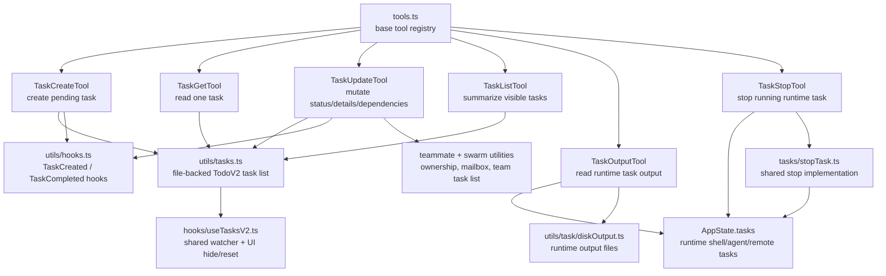

# Task Tools Design Documents

The Task-related tools cover two separate task concepts:

- TodoV2 task-list tools: persistent structured tasks stored under the Claude
  config directory and shown in the task-list UI.
- Runtime background task tools: controls for already-running shell, agent, or
  remote tasks tracked in `AppState.tasks`.

This directory documents both layers and calls out their boundary. It does not
cover `AgentTool`'s legacy tool alias named `Task`; that delegation subsystem is
documented in [agenttool](../agenttool/README.md).

| File | Covers |
|---|---|
| [task-list-tools.md](./task-list-tools.md) | `TaskCreateTool`, `TaskGetTool`, `TaskUpdateTool`, `TaskListTool` - public schemas, tool results, hooks, teammate behavior |
| [task-storage.md](./task-storage.md) | `utils/tasks.ts` and `hooks/useTasksV2.ts` - task-list identity, JSON storage, locking, watchers, UI visibility |
| [runtime-task-tools.md](./runtime-task-tools.md) | `TaskOutputTool`, `TaskStopTool`, `tasks/stopTask.ts` - background task output retrieval and cancellation |

## High-Level Map

## Registration Boundary

`TaskOutputTool` and `TaskStopTool` are always part of the base tool list when
their own environment gates allow them. The TodoV2 CRUD tools are appended only
when `isTodoV2Enabled()` is true. In normal interactive sessions TodoV2 is on;
in non-interactive sessions it is off unless `CLAUDE_CODE_ENABLE_TASKS` is set.

The runtime task tools do not read or update the TodoV2 JSON task list. They act
on live background tasks created elsewhere, such as background bash commands,
async agents, or remote sessions.

## Active Task List Identity

TodoV2 does not allocate a task-list ID when a task is created. Each
`TaskCreate`, `TaskGet`, `TaskUpdate`, and `TaskList` call resolves the current
list with `getTaskListId()`:

| Priority | Source | Effect |
|---|---|---|
| 1 | `CLAUDE_CODE_TASK_LIST_ID` | explicit override for the whole process |
| 2 | in-process teammate context | teammates share the leader's team list |
| 3 | `CLAUDE_CODE_TEAM_NAME` / `getTeamName()` | process-based teammates use the team list |
| 4 | `leaderTeamName` from `TeamCreateTool` | the leader switches from session list to team list |
| 5 | `getSessionId()` | standalone fallback |

For a normal standalone conversation, the active task list is the current
session ID. A single session can still touch multiple persisted task lists if
the resolution context changes. For example, tasks created before a team exists
go under the session ID; after `TeamCreateTool` sets `leaderTeamName`, later
task calls use the sanitized team name; after `TeamDeleteTool` clears it, calls
fall back to the session ID again.
